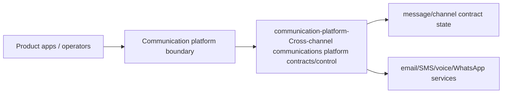
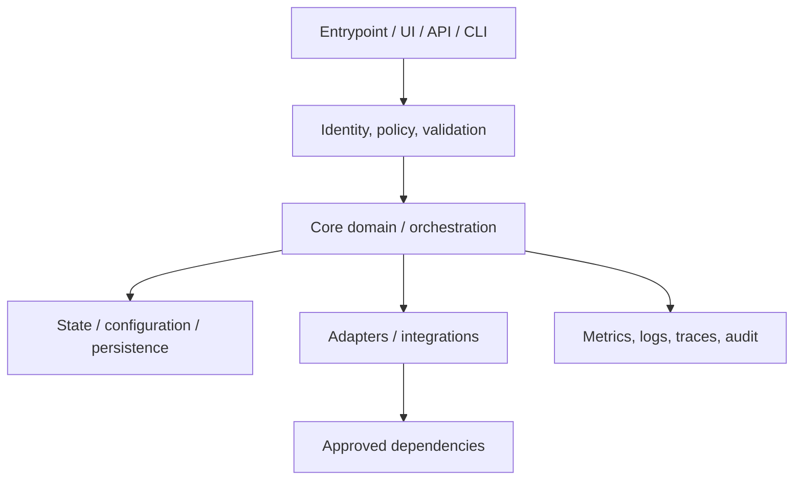
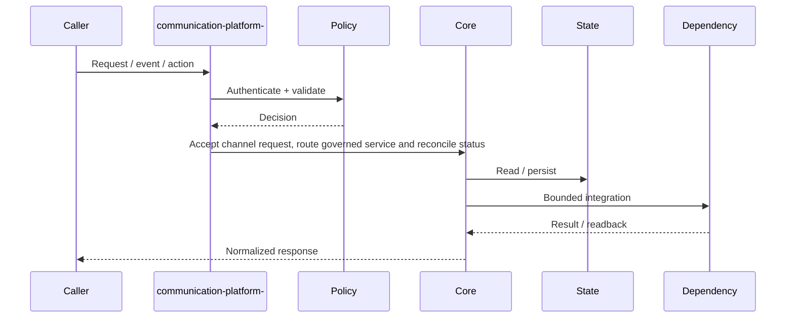
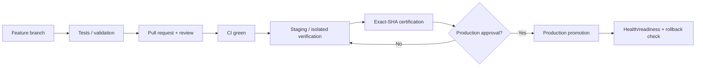
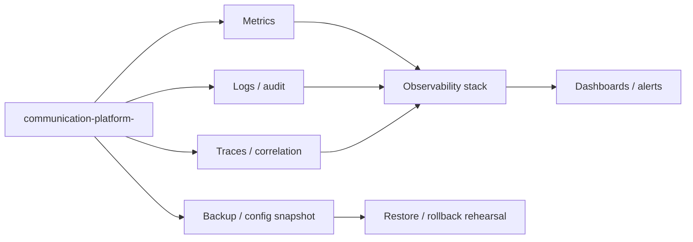

# communication-platform- — Architecture Charts

> Repository: `appolon1908/communication-platform-`  
> Baseline branch: `main`  
> Repository-local visual architecture. Update with code, contracts, ownership and deployment changes.

## 1. System context

## 2. Internal component architecture

## 3. Critical flow

## 4. Deployment and promotion

## 5. Observability and recovery

## Ownership notes
- **Role:** Cross-channel communications platform contracts/control
- **Primary boundary:** Communication platform boundary
- **State/config:** message/channel contract state
- **Dependencies/consumers:** email/SMS/voice/WhatsApp services
- Cross-repository effects must use reviewed contracts; production effects remain separately gated.
